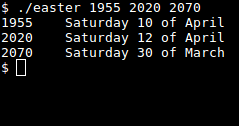

# easter
Get the date of Easter Eve



## Description
A Python3 program that calculates the date of Easter Eve according to the Gregorian calender.
Note that this is only meaningful for years after 1582.

## Usage
```
usage: easter [-h] [-v] YEAR [YEAR ...]

Get the date of Easter Eve according to the Gregorian calender. Only
meaningful for years after 1582.

positional arguments:
  YEAR           the year(s) you are interested in

optional arguments:
  -h, --help     show this help message and exit
  -v, --version  show program's version number and exit
```
